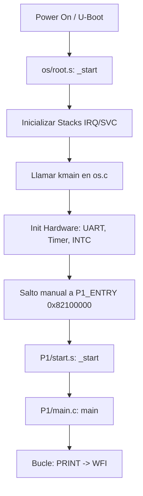
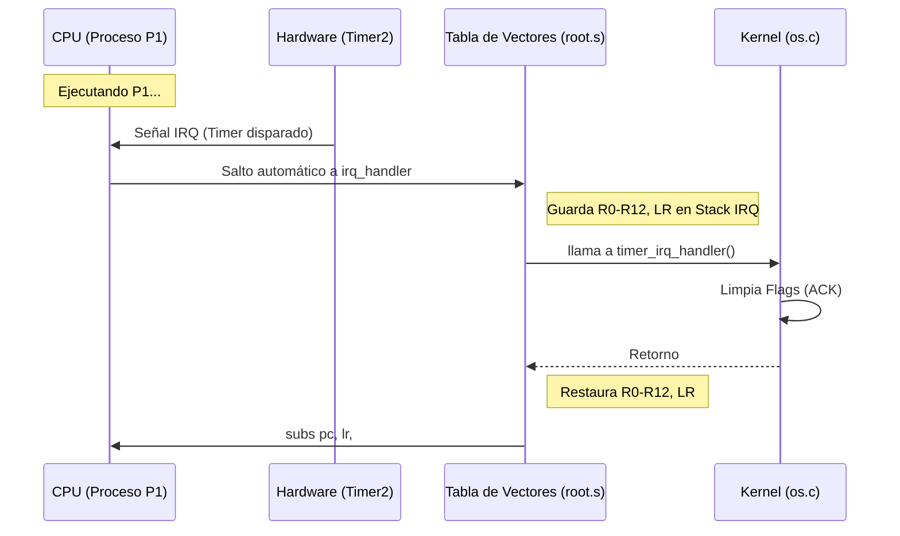

# Mapa de Funcionamiento: Sistema de Multiprogramación (Multiprogramming)

Este documento describe la arquitectura, componentes y el flujo de ejecución del sistema operativo minimalista diseñado para la plataforma BeagleBone Black (ARMv7-A / Cortex-A8).

---

## 1. Arquitectura del Sistema

El sistema se divide en tres capas principales:
1.  **Librerías (lib/):** Funciones de utilidad (I/O, strings) compartidas por el OS y los procesos.
2.  **Núcleo (os/):** Gestión de hardware (UART, Timer, INTC), manejo de interrupciones y carga de procesos.
3.  **Procesos de Usuario (P1, P2):** Aplicaciones independientes que corren en modo SVC (SuperVisor) en esta implementación.

### Mapa de Memoria (Resumen)

| Dirección | Componente | Descripción |
| :--- | :--- | :--- |
| `0x82000000` | **OS** | Punto de entrada del kernel (`_start`). |
| `0x82011000` | Stack IRQ | Pila usada durante el manejo de interrupciones. |
| `0x82012000` | Stack SVC (OS) | Pila usada por el kernel en modo Supervisor. |
| `0x82100000` | **Proceso 1 (P1)** | Punto de entrada de la aplicación P1. |
| `0x82112000` | Stack P1 | Pila asignada para la ejecución de P1. |
| `0x82200000` | **Proceso 2 (P2)** | Punto de entrada de la aplicación P2. |

---

## 2. Desglose por Archivos y Componentes

### 📂 Carpeta: `os/` (El Núcleo)

#### `root.s` (Ensamblador de Bajo Nivel)
Es el primer código que se ejecuta. Su función es preparar el hardware para el código C.
-   **`__vectors_start`**: Tabla de vectores de interrupción. Redirige el flujo a `irq_handler` cuando ocurre una interrupción de hardware.
-   **`_start`**:
    1.  Desactiva interrupciones (`cpsid if`).
    2.  Configura el **VBAR** (Vector Base Address Register) para que apunte a nuestra tabla de vectores.
    3.  Inicializa los **Stacks** para modo IRQ y modo SVC.
    4.  Limpia la sección **.bss** (pone a cero variables globales no inicializadas).
    5.  Salta a `kmain`.
-   **`irq_handler`**: Captura el contexto actual (registros R0-R12 y LR), llama a la función C `timer_irq_handler` y restaura el contexto al finalizar.

#### `os.c` (Lógica del Kernel)
Gestiona la inicialización de los periféricos y el flujo de "Multiprogramación".
-   **`kmain()`**: Función principal del kernel. Inicializa el Watchdog (desactiva), UART (vía `uart_puts`), Timer2 e INTC. Luego salta a la dirección de memoria de P1 (`0x82100000`).
-   **`timer2_init()`**: Configura el reloj del sistema para generar interrupciones periódicas (actualmente configurado para dispararse cada ~100ms o 3s según el reload).
-   **`intc_init()`**: Configura el controlador de interrupciones para permitir que el IRQ 68 (Timer 2) llegue al CPU.
-   **`timer_irq_handler()`**: Función en C que se ejecuta en cada tic del reloj. Limpia el flag de interrupción y el controlador de interrupciones (EOI).

#### `pcb.h` (Estructuras de Control)
Define el **PCB (Process Control Block)**, esencial para la multiprogramación real.
-   **`pcb_t`**: Estructura que guarda:
    -   `pid`: Identificador del proceso.
    -   `sp`: Puntero de pila guardado (Contexto).
    -   `state`: Estado (READY, RUNNING).

#### `linker.ld`
Define cómo se organizan las secciones de código (`.text`), datos (`.data`) y variables (`.bss`) en la RAM física.

---

### 📂 Carpeta: `lib/` (Librerías compartidas)

#### `print.h / print.c`
Provee una implementación minimalista de salida por consola (UART0).
-   **`uart_putc(char c)`**: Envía un carácter al registro THR de la UART.
-   **`PRINT(const char *fmt, ...)`**: Versión simplificada de `printf`. Soporta `%d`, `%c`, `%s`.

#### `stdio.h / stdio.c`
-   **`PRINT(...)`**: Un wrapper (envoltorio) sobre la función de `print.c`.

---

### 📂 Carpetas: `P1/` y `P2/` (Aplicaciones)

#### `main.c`
-   Ejecuta un bucle infinito que imprime su nombre y un contador.
-   Utiliza la instrucción `wfi` (Wait For Interrupt) para ceder el control y esperar a la siguiente interrupción de reloj, ahorrando energía.

---

## 3. Diagramas de Flujo

### Ciclo de Vida: Desde el Boot hasta el Proceso

### Manejo de Interrupciones (IRQ)

---

## 4. Complementariedad de Componentes

1.  **Ensamblador + C:** `root.s` maneja lo que C no puede (registros de estado del CPU, stacks, punteros de interrupción), mientras que `os.c` maneja la lógica de negocio y configuración de registros de periféricos complejos.
2.  **Kernel + Librerías:** El kernel utiliza `lib/` para depuración (imprimir el estado del sistema), y los procesos la usan para comunicarse con el exterior.
3.  **Encadenamiento de Linkers:** Cada componente (`os`, `P1`, `P2`) tiene su propio `linker.ld` que asegura que no colisionen en memoria, permitiendo que el OS sepa exactamente dónde saltar para iniciar una tarea.

---

## 5. Conceptos para Estudio

-   **Context Switching (Pendiente):** Actualmente el sistema salta a P1 y se queda ahí. Para multiprogramación real, el `irq_handler` debería salvar el `sp` de P1 en su PCB, cargar el `sp` de P2, y retornar a P2.
-   **Modos del Procesador:** El sistema cambia entre modo **SVC** (Kernel y Procesos) y modo **IRQ** (Manejo de interrupciones).
-   **MMIO (Memory Mapped I/O):** Se usan direcciones de memoria (como `0x44E09000`) para hablar con el hardware (UART).
